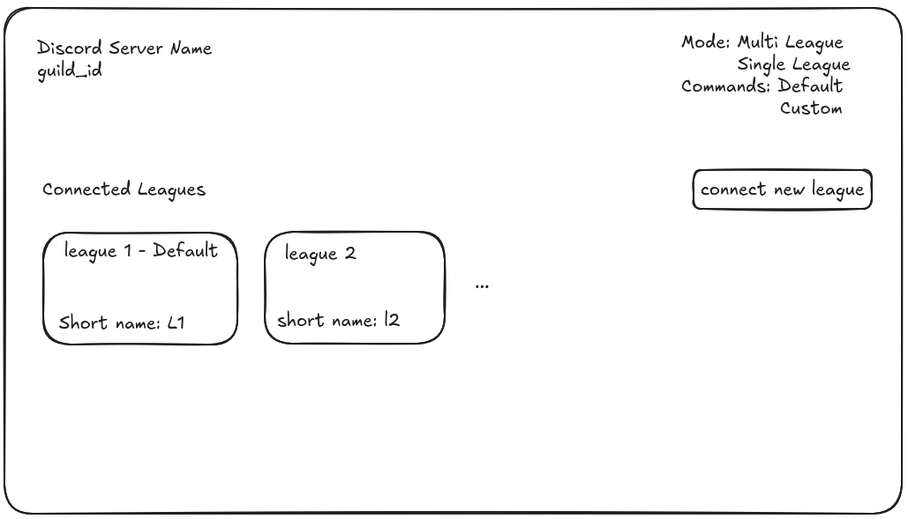

# Multi League Support

This has been a requested feature in Snallabot for the bot to support multiple leagues in one server. Right now, Snallabot permits one league in one server. This will be the plan on how to implement this change. 

## Goals

- Snallabot commands work for multiple leagues in a single discord server
- The default of one league per one server is maintained, the user experience of that is not deteroriated
- The user experience of using multiple leagues in a single discord server is equivalent to using one league in one server

# Experience

We propose that the following are added to the bot to make the multi league support just as good as the single league support. The following components should be added


## Discord Server Dashboard

When you do `/dashboard` right now it shows the following:

```
Snallabot Dashboard: https://www.snallabot.me/dashboard?discord_connection=1198780271814770829
Connected League: league_id
League Name: league_name
Current Week: current_week
```

The link for the dashboard redirects to a singular Madden league. Let us modify this to be the following:

```
Snallabot Dashboard: https://www.snallabot.me/discord_server/1198780271814770829
Connected Leagues: Week X - League Name (league_id), Week X - League Name (league_id)
```

Note the dashboard url has changed. Heading to that dashboard, we should see a new page that represents your discord server:




Features:

- You can see every league connected to your server. Clicking on the league will bring you to the original dashboard page
- Leagues have short names, these are editable and can be changed. By default when you connect a new league, it will use the EA league name
- By default, discord servers are in Single League mode. A button can change it to Multi League Mode.


## Multi League Mode

When a user hits the button to turn on Multi League Mode, we ask the user to give a short name for the server. This is a one time choice that is not editable for V0. Once this is confirmed, we will then do the following:

1. Snallabot will install Guild Application commands. These commands will be the same commands Snallabot currently supports, however they are all prepended with the short name. For example `/game_channels create` -> `/short_name_game_channels create`. These will only show up in that specific discord server
2. Each guild application command will have an extra parameter that is **required**. This parameter is `league_name` it will be the first parameter so that it has to be set. It will have autocomplete with the options set to all the short names for the leagues connected.
3. Running the command will then run that command for just that league chosen


This gives us the following flexibility:

- Single League commands do not change. There is no new league parameter that is optional and can be confusing for both multi and single leagues
- Multi league commands have command scoped to their server. The original single league commands will be connected to the **default** league, however discord server admins can choose to hide all the single league commands and only show the multi league commands. They will appear custom as they can name the prefix specific to their server. The league name will then be required making it clear to their users which league they are referring to.

This has the following cons:

- Whenever a new command is added to snallabot, we have to update the code to also install that command in the multi league servers
- Multi League discord servers need to take the time to set this up, and make sure its clear to their users.
- League settings will still have to be divided, not all commands will need multi league support and those will not be installed as guild specific.

# Implementation

## Step 1

The first step is the easiest. We can implement the discord dashboard without multi league support. This will be in preparation for the multi league support that is coming. 

## Step 2

We update the league settings to support multi league. This effectively changes the backend to support multi league, while multi leagues do not exist yet. This is a good time to do the migration of any league settings and any type changes necessary.

## Step 3


Update the command interfaces. Each command should have a new method that is just a boolean on whether that command should be supported in multi league support. Commands that return true will be installed when multi league is turned on. We also need to update the commands handler to handle the:

- stripping the prefix off of multie league commands
- mapping the guild id and the league name to the league id
- function to install the multi league commands in a specific server. Update the install methods for global commands to also install for multi league servers


## Step 4

Finally, we can update the discord dashboard page to support multi league. This will then release the feature!


# Alternatives

## Why not use guild specific commands per league

This would be really nice and ideal in my opinion. We could namespace each command like `/player get` -> `/league_name_player get`. And it would be supert clear which league youre using. However, Discord has a max of 100 guild specific application commands. This means we would probably be able to support around 5-10 leagues and we would hit the max quicker as new commands are added. This does not seem scalabale

## League name as optional on all commands

It seems too easy to just forget to use the league name. The UX of it seems more clunky, and it will be there on every command when >90% of servers will not even use it. It seems like it may be confusing to start with. 
