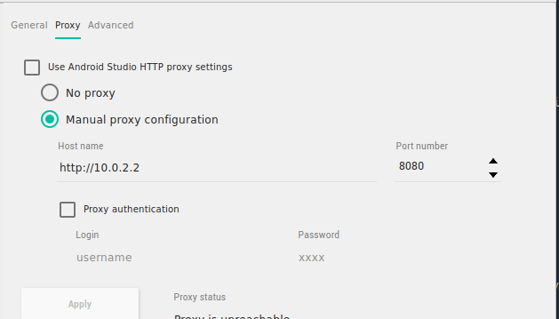

# Guide to Reverse Engineering the Companion App

Confirmed to be working as of August 27 2026, with Android emulator API 37. This was done on the Madden 27 Companion App

## Tools

Some tools that will be necessary, installing these tools is up to you:


- Android Studio (this comes with adb, emulator, avd commands. you may need to resolve paths to use them on command line)
- mitmproxy
- frida-tools
- frida-server (must match emulator architecture)
- objection


## Retrieving an APK

The first step is retrieve the Madden APK. This can be done a few ways:

- You can find it online, however you have to make sure you find the right APK for the emulator you are using. Which has to match the architecture and API version
- You can download it on an emulator with Google Play services. 

### Pulling APK from Emulator

You must setup an Emulator with the Google Play services (as opposed to just the Google APIs). This means the emulator will come with Play Store on it. You can then login to the play store and download the Madden Companion App. However, this does pose some privacy risk, as you need to have a Google account, which can most likely be linked back to you. 

Once you download the APK to pull it off the device you can do the following:

```sh
adb shell pm path com.ea.gp.madden19companionapp
```

That will give you the path to the APK on the device, 

```sh

adb shell pull <PATH_FROM_ABOVE> madden.apk
```

that will pull the apk from that path, and put it on your local machine as a file named madden.apk. You may now close this emulator, as we cannot use it for reverse engineering

## Setting up emulator

Setup a new emulator, with ideally the same Android API, this time only with the **Google API services**

Then install the apk on it using adb

```sh
adb install madden.apk
```

### Installing mitmproxy certificate

To sniff the traffic on the device, we will use mitmproxy. To get HTTPS traffic, we will have to install the mitmproxy certificate on the device as well. These are the steps to do so. 

1. Find your mitmproxy certificate. For me this was in ~/.mitmproxy as I work on Linux. This may change for windows/Mac. 
2. For Android, we have to make the certificate with a specific hashed name. This command will do so, this may have to be modified for other OS
   ```sh
   hashed_name=`openssl x509 -inform PEM -subject_hash_old -in mitmproxy-ca-cert.cer | head -1` && sudo cp mitmproxy-ca-cert.cer $hashed_name.0
   ```
   This should create a file that looks something like `c8750f0d.0`
3. Now we must make the emulator system writable
   ```sh
   adb root
   adb disable-verity
   adb reboot # wait for device to reboot
   adb root
   adb remount # may need to reboot again after this, if so root and remount again
   ```
4. Try to put the certificate in cacerts
   ```sh
   adb push ~/.mitmproxy/c8750f0d.0 /system/etc/security/cacerts/c8750f0d.0
   adb shell chmod 644 /system/etc/security/cacerts/c8750f0d.0
   adb reboot
   ```
5. Verify the certificate is on the device. Settings -> Security -> More Security / Advanced -> Encryption & credentials. You should see mitmproxy in there, if it is not, try this next step. If it is, head to the next section
6. If cacerts failed, we can put it in apex certs. do the following commands:
   ```sh
   adb root
   adb remount
   adb shell mkdir -p /data/local/tmp/cacerts
   adb shell cp /apex/com.android.conscrypt/cacerts/* /data/local/tmp/cacerts/
   adb push ~/.mitmproxy/c8750f0d.0 /data/local/tmp/cacerts/c8750f0d.0
   adb shell chmod 644 /data/local/tmp/cacerts/c8750f0d.0
   adb shell chown system:system /data/local/tmp/cacerts/c8750f0d.0
   adb shell mount -o bind /data/local/tmp/cacerts /apex/com.android.conscrypt/cacerts
   adb shell stop
   adb shell start
   ```
7. Then check again, you should see the certificate there titled mitmproxy. Do not reboot the device. The above is has to be repeated on every device reboot.

### Connect mitmproxy

Before setting up the proxy, open the companion app, login to your EA account so that its all saved on the device. Make sure it is working without the proxy first. **You may need to disable your mitmproxy certificate first in the settings, sign in, then go back and renable it**

run mitmproxy on your machine

```sh
mitmproxy  --listen-port 8080
```

Then on your emulator side bar, hit the 3 dots. Go to settings, and connect to the proxy with



It is okay if it says unreachable, you should see traffic going through your mitmproxy. You can also do this with the command line:

```sh
adb shell settings put global http_proxy 10.0.2.2:8080 # turns it on
adb shell settings put global http_proxy :0 # turns it off
```

### Opening the Madden Companion App

Keep your app open on the home page, lets setup frida and objection 

You must have:

- frida-tools
- objection
- frida-server

The last one you can download from Frida's githhub page, but you have to match your frida version and you have to get the `-android-ARCH` that matches your emulator. In my case, it was `android-x86_64`

Start frida-server on the device

```sh
adb push frida-server-VERSION-android-ARCH /data/local/tmp/frida-server
adb shell chmod 755 /data/local/tmp/frida-server
adb shell /data/local/tmp/frida-server &
```

Now open the Companion app, then start objection

```sh
objection -g com.ea.gp.madden19companionapp explore
```

In your objection shell, run:

```sh
android sslpinning disable
android root disable
```

And we have done it, now if you click around in the app, you will see all the requests the app makes! Happy reverse engineering!
