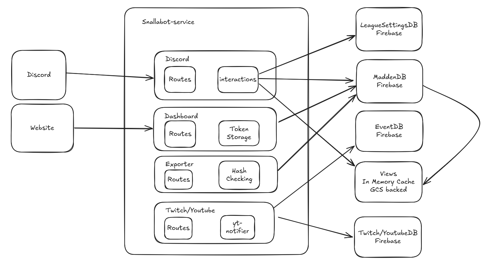

# Architecture Overview



## Discord

The discord routes have the entry point for any Discord bot. This handles:
- responding to Slash Commands
- responding to Autocomplete text
- responding to Message interactions

Each command is registered in [commands_handler.ts](https://github.com/snallabot/snallabot-service/blob/main/src/discord/commands_handler.ts). Adding a new command becomes as simple as defining the CommandHandler interface. All current command implementations are found [here](https://github.com/snallabot/snallabot-service/tree/main/src/discord/commands)

Commands have to respond quick, within 3 seconds. There are ways to respond, and then edit the response later which many commands do. Each command has access to all the DBs availaible in Snallabot, and various commands may use a combination of both. 

There are also event listeners that update both Discord state (game channels) and Madden state (game channel scoreboard). These are useful to listen to events both from Discord itself (reactions clicked on game channels), or data changes in leagues Madden data. 

**By default, one Discord server can only connect to one Madden league**. However, a single Madden league can be part of multiple Discord servers. 

### Firebase

Snallabot stores Discord command settings in Firebase. It also stores various mappings and state in LeagueSettingsDB. LeagueSettingsDB are the only entry point in this storage. 

## Dashboard

The dashboard routes are the main entry point for the Snallabot dashboard website. This contains all the routes to setup the dashboard and includes the final Dashboard page that shows your leagues. Details:

- The web pages are currently generated using Pug templates. The HTML, CSS, and JS are relatively minimal and relies on [Bootstrap](https://getbootstrap.com/). I think if we want to do any more heavy lifting we may want to consider moving to Svelte or normal React. I did not want to introduce the overhead of that yet
- By default, these routes start /dashboard. There is currently no home page
- Linking a discord server to a Madden league is done via query parameters that is passed through the setup. However, the actual dashboard pages use the league id as the url slug. If the discord connection is passed in, it will redirect to its connected league or redirect to the dashboard home page. 

## Exporter

See [Madden Export API](../madden/export_api.md) for full details on Madden export data API. Snallabot implements all routes and saves all data from EA in MaddenDB. Madden sends the latest state of all the data for every route. Details:

### Data Storage

Snallabot adopts a style of Event Sourcing, meaning we store each individual event from Madden. The actual underlying storage however by default retrieves the latest state. However, Snallabot keeps history of all the changes to the state. So it is possible to replay the series of changes in your league if desired. Therefore, **Snallabot by default stores data maximally**, every change is accounted for as long as the data is exported. This is because losing data can hinder any future developments. In firebase this looks like the following structure of collection and documents:

madden_data26 -> collection of league documents (keyed by league id) -> 1 league ID document -> `MADDEN_` collections (one per event type) -> madden data document (keyed by specific ids per collection type) -> history collection -> documents tracking the changes to this madden data. 

Example

madden_data26 -> League 1->  `MADDEN_PLAYER` (roster data) -> Player 1 -> Player 1 Data -> history (optional) -> history 1 (Player change before current state)

In the above example, ids are fake. The Player 1 data has all the values for that Player, and the history would look like so 
```json
  throwOnRunRating:
   {
	oldValue: 88,
	newValue: 90
   }
  timestamp: Jan 1 2025 12:00
```

#### Optimize Writes

Due to the nature of the data, there are a lot of players and player stats. Since Madden will send the data regardless of if it changed, Snallabot implements a hash check. This works like so:

Snallabot receives Player 1 with data {x: 1, y: 2...}. Snallabot sees there is no current hash of this player, then hashes Player 1, saves this in memory, and writes this to disk (for durabality). The player is then written to MaddenDB (to Firebase).

Snallabot then receives Player 1 again later on with same data {x: 1, y: 2...}. Snallabot computes the hash, checks against the previous hash (retrieving from disk if not in memory). If the hash is the same, Snallabot skips writing the data completely and moves on. 

By default, **this feature is turned off** as it is incremental and durable, this may be confusing. Snallabot itself has it turned on for cost optimizations. For a single league, this isnt worth it. 

#### Views

Certain queries on MaddenDB have to be super fast or are expensive to run. Autocomplete for example needs to have fast response times. Snallabot has a View system that creates in memory caches of views that update when the underlying data update. These are used to serve team names for the team autocomplete, and player names for the player autocomplete. The player one also writes this view to file storage for more durability, as querying all the Players in your league can be costly

The cache updates by listening to events from MaddenDB so we do not have to do TTL invalidation. 

### Duplicates

Madden will send duplicate data when a title update happens. This looks like:
- all team ids have been changed
- all player ids have been changed
- schedules and stats will be duplicated, new data will have new ids

Snallabot handles all these duplicates gracefully in MaddenDB, but properly deduplicating data and mapping ids back to the **latest** id. Therefore, all the logic is handled in one place. This is one pro of the maximal approach to data. 

### Firebase

Firebase is the backing DB for MaddenDB (and other parts of Snallabot). In the future, this may change. However, all access points of Madden data go through MaddenDB, therefore it is a matter of implementing the interface again with a different underlying storage option


## Twitch/Youtube

Snallabot comes with Twitch and Youtube live stream notifications.

### Twitch

Twitch has EventSub that sends events to Snallabot. These are their own separate routes. Snallabot receives events when registered usrs go live on Twitch. 

### Youtube

Youtube has no such API, therefore Snallabot has a script that runs every 5 minutes that checks all Youtube channels to see if they are currently streaming or not. If they are, Snallabot will notify for those channels if they apply to the broadcast configuration. 

### Firebase

Snallabot keeps track of which channels (both Youtube and Twitch) in Firebase. Both are stored in separate collections. 
